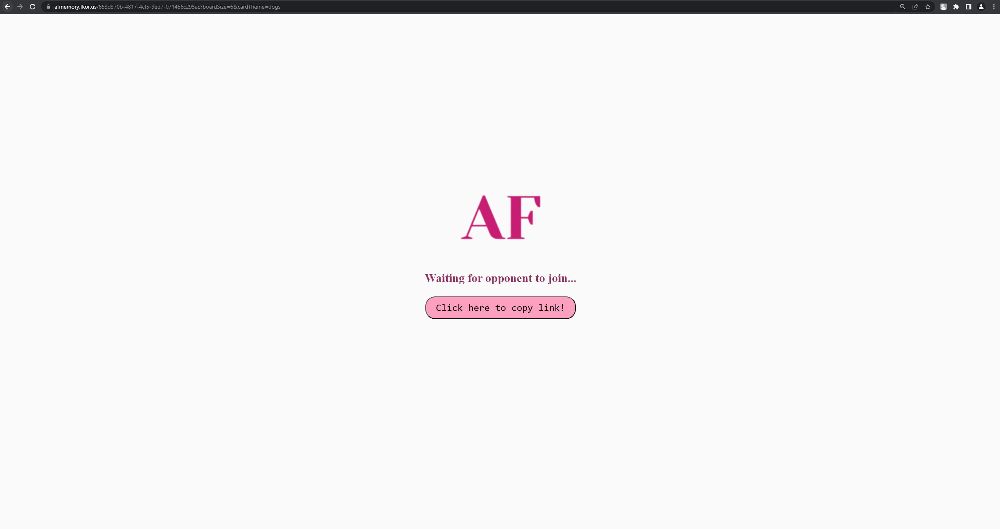

# AF memory game

2-player memory game with two card themes to choose from. Game is available [here](https://afmemory.fkor.us).

**Authors**:

[Filip Korus](https://fkor.us/) <[fkorus@student.agh.edu.pl](mailto:fkorus@student.agh.edu.pl)>

[Aleksandra Łapczuk](https://github.com/alapczvk) <[alapczuk@student.agh.edu.pl](mailto:alapczuk@student.agh.edu.pl)>

## Used technologies

- Node.js
- Express
- Socket.io
- React
- Docker

## Requirements

- Node.js (version 16.16 or higher)
- docker
- docker-compose

### Project structure

Project is divided into 2 main directories.

- [client](client) - client (React with TypeScript, Socket.io)
- [server](server) - server (Node with TypeScript, Express, Socket.io)

## Project preview

*Starting page*

*Level and card theme chosen*

*Waiting for opponent to join*

*Gameplay*

*Endgame*

*Opponent left during game*

*Room is full*

